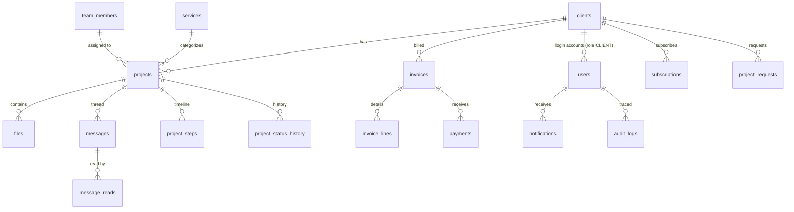

# LEVEL UP IA — Dashboard : Complete Build Plan

> Source of truth: `data/LevelUpIA_Dashboard_2026-08-23_cahier-des-charges.pdf` (23 août 2026).
> Scope rule from the cahier des charges: **only chapters 4 and 5 are to be developed.** Chapter 6
> (Clarity analytics + VPN blocking) is out of scope until validated in writing.

---

## 1. What the project is (summary of the documents)

One Next.js application, one login page. After login, each user is redirected to their space by role:

| Role | Sees | Never sees |
|---|---|---|
| **Admin** | Everything: clients, projets, livrables, messagerie, factures, abonnements, équipe | — |
| **Client** | Only their own projets, livrables, messages, factures | Anything belonging to another client |

**Only two login roles.** The "Équipe" screen manages team members (assignment + workload) but does
**not** create login accounts (to confirm — chapter 8, point 1). The schema keeps a nullable
`team_members.user_id` so adding a team login later needs zero migration.

### Navigation
- **Admin:** Tableau de bord · Clients · Projets · Messagerie · Factures · Abonnements · Équipe · Déconnexion
- **Client:** Mes projets · Messages · Mes factures · Historique · Nouveau projet · Mon profil · Déconnexion

### The 18 features (all with acceptance criteria — see §8)
Client: suivi d'avancement, téléchargement des livrables, factures (+ paiement si passerelle),
messagerie par projet, notifications, historique, demande de nouveau projet/devis, profil.
Admin: gestion clients, gestion projets, suivi CA/paiements, attribution équipe, dépôt livrables,
facturation numérotée, messagerie centralisée, rôles/permissions serveur, statistiques, abonnements.

### Hard technical requirements (architecture doc §7)
- Server-side isolation between clients — provable at delivery (changing the URL must be refused by the server).
- Files stored **outside** the public folder, non-guessable download links, allowed types + max size enforced.
- Sequential invoice numbers, never duplicated.
- Reliable e-mail service, sender "Level Up IA", editable templates.
- Next.js on Vercel, PostgreSQL, dedicated file storage, single deployment on the Level Up IA account.
- Daily automatic backup, restoration tested before go-live.
- Client space must work perfectly on mobile (most clients connect from their phone).

### Brand / design direction (from the two mockups)
- Colors: blue `#1860FC`, violet `#6C24FC`, ink `#000024`. Logo used as-is, never modified.
- Shared layout: fixed left sidebar (~240px), top bar with search + account, content center.
- Every screen opens with a **dark gradient hero banner** carrying the key numbers, then detail lists below.
- Currency displayed as **DT** (Tunisian dinar, 3 decimals).
- Interface language: **French** (confirm other languages — ch. 8, point 5).

---

## 2. Technology stack

| Layer | Choice | Why |
|---|---|---|
| Framework | **Next.js 15 (App Router) + TypeScript** | Required by spec (site is already Next.js on Vercel); one app, two spaces |
| Styling | **Tailwind CSS v4** | Requested; design tokens for the brand colors; mobile-first |
| API | **GraphQL Yoga + Pothos (code-first)** on `/api/graphql` | Fast, type-safe end-to-end, runs inside Next.js (single deployment) |
| ORM | **Prisma** (schema introspected from `database/schema.sql`) | Type-safe queries, migrations, connection pooling |
| Database | **PostgreSQL** (Neon or Vercel Postgres in prod, Docker locally) | Required by spec; schema in `database/schema.sql` |
| Auth | **Auth.js (NextAuth v5)** — credentials + JWT in httpOnly secure cookies | One login, role-based redirect; no token in localStorage |
| Password hashing | **argon2id** | Current best practice |
| File storage | **Vercel Blob** (or S3-compatible) — private bucket | Outside public folder; downloads via permission-checked API route + UUID |
| E-mail | **Resend** + React Email templates | Reliable sender, templates editable without touching business code |
| Charts | **Recharts** | The CA area chart + revenue bars of the dashboard |
| GraphQL client | **Apollo Client** (or urql) | Cache, optimistic updates for messagerie |
| Validation | **Zod** on every mutation input | Never trust client input |

---

## 3. Database (done — `database/schema.sql`)

Design decisions:
- **`BIGSERIAL`** primary keys — SERIAL as requested, in its 64-bit form so it can never
  overflow. Plus a **UUID `public_id`** on every entity exposed in a URL:
  internal ids never leak, download links are non-guessable (spec requirement).
- **Money as `NUMERIC(12,3)`** — DT has 3 decimals; never floats.
- **French enums** matching the exact statuses of the cahier des charges
  (`EN_ATTENTE / EN_COURS / EN_REVISION / LIVRE / CLOTURE`, invoice `PAYEE / EN_ATTENTE / EN_RETARD`…).
- **Soft delete** (`deleted_at`) on clients/projects/files so invoices and history never break.
- **`invoice_counters` + `next_invoice_number()`** — atomic sequential numbering per year
  (`F-2026-041`), race-condition-proof, uniqueness also enforced by a UNIQUE constraint.
- **`project_steps`** (Brief reçu → Production → Première version → Votre validation → Livraison
  finale) + **`project_status_history`** = the dated timeline the client sees.
- **`message_reads`** per user (scales to several users per client company).
- **`audit_logs`** for credibility/traceability; **`ip_exceptions` / `access_denials`** already
  prepared but only used if chapter 6.2 (VPN) is validated.
- Reporting **views**: `v_revenue_by_month`, `v_revenue_by_service`, `v_team_workload`.
- Indexes on every foreign key and every dashboard filter (status, due_date, renewal_date, unread notifications).

Entity relationships:



---

## 4. Security model (spec chapter 5 "Gestion des rôles" + §7)

1. **Every GraphQL resolver is scoped server-side.** The context carries `{ userId, role, clientId }`
   from the verified session cookie. Every client query is filtered by `clientId` **in the SQL**,
   never by hiding UI. Acceptance test: logged in as client A, requesting a project of client B by
   its id returns `FORBIDDEN` — including by editing the URL.
2. **Auth:** argon2id hashes, httpOnly + Secure + SameSite=Lax session cookie, brute-force lockout
   (`failed_login_attempts` / `locked_until`), password reset by hashed one-time token.
3. **GraphQL hardening:** introspection disabled in production, query-depth limit (≤ 8),
   cost/complexity limit, no batching abuse, generic error messages (no stack traces),
   Zod validation on all inputs, Prisma = parameterized queries (no SQL injection).
4. **Files:** private bucket, upload restricted to allowed MIME types + max size, download only via
   `/api/files/[uuid]` which checks session → project → client ownership before streaming.
5. **Rate limiting** on login, messages, uploads. Security headers (CSP, HSTS, X-Frame-Options)
   via `next.config` / middleware.
6. **Audit log** on login, invoice actions, file uploads/downloads, deletions.
7. **Reliability ("never down because of a bug"):** TypeScript strict, error boundaries on every
   page, global GraphQL error handler (a failing resolver never crashes the process), DB transactions
   for multi-step writes (invoice + lines + counter), health-check endpoint, daily automated DB
   backup + tested restore, staging environment before production.

---

## 5. Project structure

```
levelup-ai-platforme/
├── database/schema.sql          # ← done
├── docs/PROJECT_PLAN.md         # ← this file
├── prisma/schema.prisma
├── src/
│   ├── app/
│   │   ├── (auth)/login/
│   │   ├── admin/               # layout with admin sidebar (guard: role ADMIN)
│   │   │   ├── page.tsx         # Tableau de bord
│   │   │   ├── clients/  projets/  messagerie/  factures/  abonnements/  equipe/
│   │   ├── client/              # layout with client sidebar (guard: role CLIENT)
│   │   │   ├── projets/  messages/  factures/  historique/  nouveau-projet/  profil/
│   │   └── api/
│   │       ├── graphql/route.ts
│   │       ├── files/[uuid]/route.ts     # permission-checked download
│   │       └── auth/[...nextauth]/route.ts
│   ├── graphql/                 # Pothos schema: types, queries, mutations, guards
│   ├── components/              # ui/ (Button, Card, Badge, HeroBanner…), charts/, layout/
│   ├── lib/                     # prisma, auth, zod schemas, mail, storage, rate-limit
│   └── styles/
└── docker-compose.yml           # local Postgres
```

---

## 6. Build phases (step by step)

### Phase 0 — Foundations (day 1)
- [ ] `create-next-app` (TypeScript, Tailwind, App Router, src dir) + ESLint/Prettier strict
- [ ] `docker-compose.yml` with Postgres 16; apply `database/schema.sql`
- [ ] Prisma introspection + client generation; seed script (1 admin, services, demo data of the mockups)
- [ ] Design tokens in Tailwind: brand colors, dark banner gradient (`#1860FC → #6C24FC` on `#000024`), Inter font, spacing/radius scale from the mockups

### Phase 1 — Auth & the two spaces (days 2–3)
- [ ] Auth.js credentials login (single login page, brand design)
- [ ] Role redirect: ADMIN → `/admin`, CLIENT → `/client`; middleware guarding both trees
- [ ] Shared shell: fixed sidebar (240px, collapsible → bottom nav / drawer on mobile), top bar (search, bell, account), dark hero banner component
- [ ] Brute-force lockout + audit log on login

### Phase 2 — GraphQL API core (days 3–5)
- [ ] Yoga + Pothos setup with auth context and `admin` / `ownClient` guards
- [ ] CRUD: clients, services, team_members, projects (+ steps, status history), scoping tests
- [ ] Hardening: depth limit, disabled introspection (prod), error masking, Zod inputs

### Phase 3 — Admin space (days 5–9)
- [ ] **Tableau de bord**: hero KPIs (CA du mois, projets en cours, factures impayées, demandes de révision) with 7j/30j/12mois period switch; CA area chart; revenu par service bars; projets triés par échéance; messagerie preview; factures à suivre
- [ ] **Clients**: list + fiche client (coordonnées, projets, paiements history), create/edit/delete
- [ ] **Projets**: list + filters, creation linked to client (service, prix, délais), status changes (writes history + steps), "Assigné à" field
- [ ] **Équipe**: members CRUD + workload (`v_team_workload`)
- [ ] **Livrables**: upload to private storage (type/size validated), versioning, visible client-side immediately

### Phase 4 — Client space, mobile-first (days 9–12)
- [ ] **Mes projets**: hero of the priority project (status, livrables count, échéance, facture liée), deliverables list with download, dated timeline (Avancement), **Approuver le livrable / Demander une révision** buttons, other projects with progress bars
- [ ] **Messages**: one thread per project, unread badges
- [ ] **Mes factures**: list + detail; "Payer" button hidden until a gateway is confirmed (ch. 8 pt 4)
- [ ] **Historique**: all past + current projects with dates and amounts
- [ ] **Nouveau projet**: request form → visible admin-side (`project_requests`)
- [ ] **Mon profil**: contact/company/billing info (reused on next invoices), password change

### Phase 5 — Messagerie admin + notifications (days 12–14)
- [ ] Admin **Messagerie**: all threads grouped by project, reply, read receipts
- [ ] Notifications: bell + dropdown; triggers = status change, new deliverable, new invoice, new message, subscription due, new request; each links to its element
- [ ] E-mail mirror via Resend + React Email templates (editable without touching code)

### Phase 6 — Factures & Abonnements (days 14–17)
- [ ] Invoice creation with `next_invoice_number()` in one transaction (lines, VAT, totals)
- [ ] Status flow BROUILLON → EN_ATTENTE → PAYEE / EN_RETARD (auto by due date); payments recording
- [ ] PDF generation + manual/automatic e-mail send
- [ ] Abonnements: CRUD, renewal alert before `renewal_date` (Vercel Cron)

### Phase 7 — Hardening, tests, delivery (days 17–21)
- [ ] Isolation test suite (client A vs client B on every query/mutation/download) — **demonstrable at delivery**
- [ ] Rate limiting, security headers, dependency audit
- [ ] Responsive audit of every screen at 360px / 768px / 1280px
- [ ] Daily backup configured + **restore rehearsal**
- [ ] Staging → production on the **Level Up IA Vercel account**; delivery pack: repo access, hosting/DB/domain access, first admin credentials, installation note (spec §8)

---

## 7. Open questions (chapter 8 — ask before the relevant phase)

1. Équipe screen = management only, no login accounts? *(assumed yes; schema is future-proof either way)*
2. VPN blocking: whole site or only the two spaces? *(out of scope until validated — tables ready)*
3. Are the two chapter-6 features retained, at what budget? *(assumed no for v1)*
4. Payment gateway: which one, if any? *(assumed none for v1 → "Payer" button hidden)*
5. Launch language French only? Other languages later? *(assumed French; keep strings in one dictionary file to ease future i18n)*

---

## 8. Acceptance criteria checklist (must all pass before delivery)

| # | Criterion (from the cahier des charges) |
|---|---|
| 1 | Client opens a project and reads its status + the date of each step, without asking the team |
| 2 | Client downloads a file from the project page (no e-mail/WhatsApp) |
| 3 | Client finds every invoice, its status and detail |
| 4 | A message sent from a project arrives admin-side, attached to that project |
| 5 | Status change / new deliverable / new invoice each trigger an alert linking to the element |
| 6 | A closed project stays visible with its date and amount |
| 7 | The "Nouveau projet" form creates a request visible admin-side |
| 8 | Profile changes are reused on the following invoices |
| 9 | From a client record, all their projects and payments history is reachable |
| 10 | A created project appears immediately in that client's space |
| 11 | Revenue readable by month / service / client; unpaid isolated in one click |
| 12 | Every project shows its assignee; workload per member is visible |
| 13 | An uploaded file becomes visible and downloadable client-side |
| 14 | Invoice numbering is sequential; two invoices never share a number |
| 15 | All exchanges readable from one admin screen, grouped by project, with reply |
| 16 | Logged as client A, opening client B's project is refused **by the server**, even via URL editing |
| 17 | The 4 KPIs (projets en cours, délai moyen, revenu/service, taux de renouvellement) recompute over a chosen period |
| 18 | A subscription reaching its term triggers an alert before the date |
